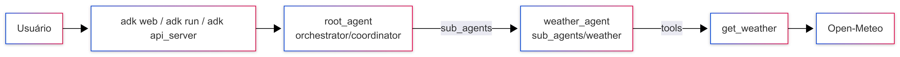

## Weather Team ADK – Orquestrador + sub-agente

Exemplo com [Google ADK](https://adk.dev/): um **orquestrador** que delega para um **sub-agente** de clima, e esse sub-agente chama uma **function tool** na [Open-Meteo](https://open-meteo.com/) (API pública, sem API key).

### Arquitetura



### Estrutura principal

- [`agents/`](agents/)
  - [`weather_team/`](agents/weather_team/) — app ADK (pasta descoberta pelo CLI)
    - [`agent.py`](agents/weather_team/agent.py) — exporta `root_agent`
    - [`config.py`](agents/weather_team/config.py) — modelo e configs
    - [`utils/`](agents/weather_team/utils/) — `load_prompt()`
    - [`orchestrator/`](agents/weather_team/orchestrator/)
      - [`agent.py`](agents/weather_team/orchestrator/agent.py)
      - [`prompts/`](agents/weather_team/orchestrator/prompts/) — [`description.md`](agents/weather_team/orchestrator/prompts/description.md) + [`instruction.md`](agents/weather_team/orchestrator/prompts/instruction.md)
    - [`sub_agents/weather/`](agents/weather_team/sub_agents/weather/)
      - [`agent.py`](agents/weather_team/sub_agents/weather/agent.py)
      - [`tools.py`](agents/weather_team/sub_agents/weather/tools.py)
      - [`prompts/`](agents/weather_team/sub_agents/weather/prompts/) — [`description.md`](agents/weather_team/sub_agents/weather/prompts/description.md) + [`instruction.md`](agents/weather_team/sub_agents/weather/prompts/instruction.md)
- [`Dockerfile`](Dockerfile)
- [`docker-compose.yml`](docker-compose.yml)
- [`requirements.txt`](requirements.txt)
- [`.env.example`](.env.example)

- [`agents/weather_team/agent.py`](agents/weather_team/agent.py)
  - Contrato do ADK: só reexporta `root_agent` a partir do orquestrador.
- [`agents/weather_team/config.py`](agents/weather_team/config.py)
  - Constantes compartilhadas (`MODEL`).
- [`agents/weather_team/utils/`](agents/weather_team/utils/)
  - Helper `load_prompt()` em [`utils/prompts.py`](agents/weather_team/utils/prompts.py) para ler os `.md`.
- [`agents/weather_team/orchestrator/`](agents/weather_team/orchestrator/)
  - Coordinator + prompts locais em [`orchestrator/prompts/`](agents/weather_team/orchestrator/prompts/).
- [`agents/weather_team/sub_agents/weather/`](agents/weather_team/sub_agents/weather/)
  - Sub-agente, [`tools.py`](agents/weather_team/sub_agents/weather/tools.py) e prompts locais em [`prompts/`](agents/weather_team/sub_agents/weather/prompts/).

### Fluxos típicos

- **Clima**: coordinator → `weather_agent` → `get_weather` → resposta em português.
- **Geral / cumprimento**: o orquestrador responde sozinho.
- **Cidade inválida**: a tool retorna `status: error`; o agente não inventa temperatura.

### Explicação do código

#### [`agent.py`](agents/weather_team/agent.py) (entrada ADK)

```python
from .orchestrator import coordinator
root_agent = coordinator
```

O CLI procura a variável global `root_agent` neste módulo.

#### [`config.py`](agents/weather_team/config.py)

Centraliza o nome do modelo Gemini usado por orquestrador e sub-agentes (lido de `MODEL` no [`.env`](.env.example)).

#### Prompts colocalizados

Cada agente carrega os `.md` da própria pasta `prompts/`:

| Pasta | Arquivos |
| --- | --- |
| [`orchestrator/prompts/`](agents/weather_team/orchestrator/prompts/) | [`description.md`](agents/weather_team/orchestrator/prompts/description.md), [`instruction.md`](agents/weather_team/orchestrator/prompts/instruction.md) |
| [`sub_agents/weather/prompts/`](agents/weather_team/sub_agents/weather/prompts/) | [`description.md`](agents/weather_team/sub_agents/weather/prompts/description.md), [`instruction.md`](agents/weather_team/sub_agents/weather/prompts/instruction.md) |

#### [`orchestrator/agent.py`](agents/weather_team/orchestrator/agent.py)

Cria o `coordinator` com prompts locais e `sub_agents=[weather_agent]`.

#### [`sub_agents/weather/agent.py`](agents/weather_team/sub_agents/weather/agent.py)

Cria o `weather_agent` com prompts locais e `tools=[get_weather]`.

#### [`sub_agents/weather/tools.py`](agents/weather_team/sub_agents/weather/tools.py)

Function tool tipada + docstring. O ADK a envolve em `FunctionTool`. Consulta geocoding e forecast da Open-Meteo e devolve um `dict` com `status`.

### Dependências e ambiente

- Python ≥ 3.10 (recomendado 3.12)
- Dependências em [`requirements.txt`](requirements.txt) (`google-adk>=2.5.0`)
- Variáveis em [`.env.example`](.env.example): `GOOGLE_API_KEY`, `GOOGLE_GENAI_USE_ENTERPRISE`, `MODEL`

```bash
cp .env.example .env
```

### Como rodar localmente

```bash
python -m venv .venv
.venv\Scripts\Activate.ps1
pip install -r requirements.txt

adk web agents
# ou: adk run agents/weather_team
# ou: adk api_server agents
```

Exemplos: 

`Qual a temperatura em São Paulo?` 

`Como está o clima em Tokyo?`

### Docker

Build definido em [`Dockerfile`](Dockerfile) e orquestração em [`docker-compose.yml`](docker-compose.yml):

```bash
docker compose up --build
```

Sobe `adk api_server` em `http://localhost:8080`.

### Referências

- [ADK](https://adk.dev/)
- [Multi-agent patterns](https://developers.googleblog.com/en/developers-guide-to-multi-agent-patterns-in-adk/)
- [Open-Meteo](https://open-meteo.com/en/docs)
